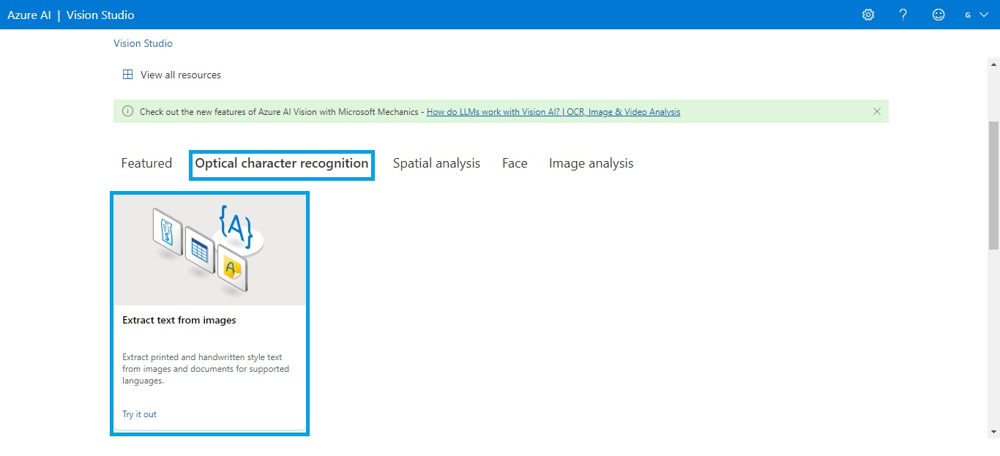
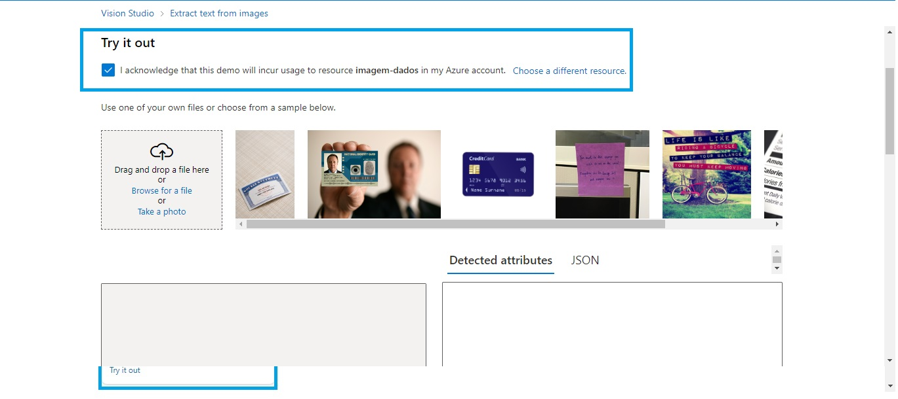
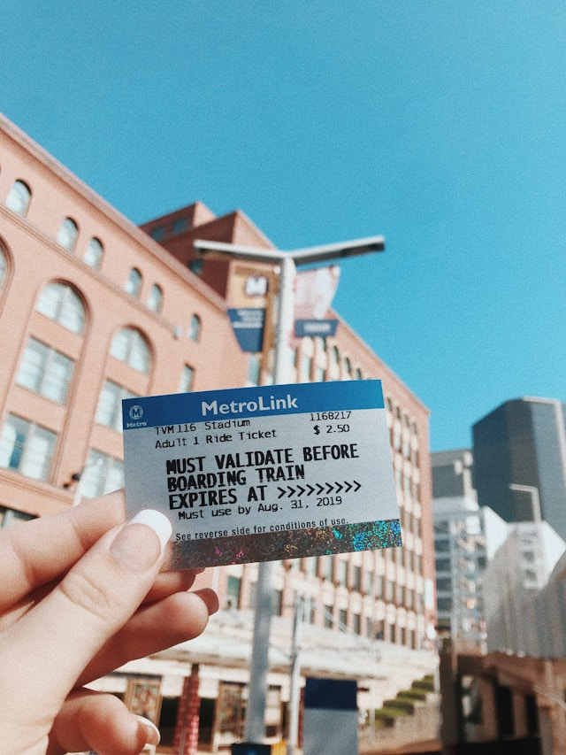
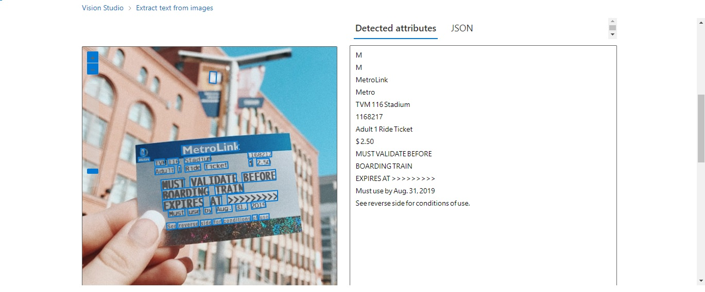
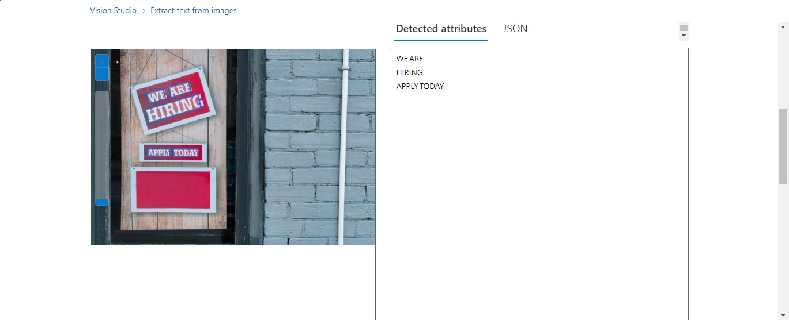
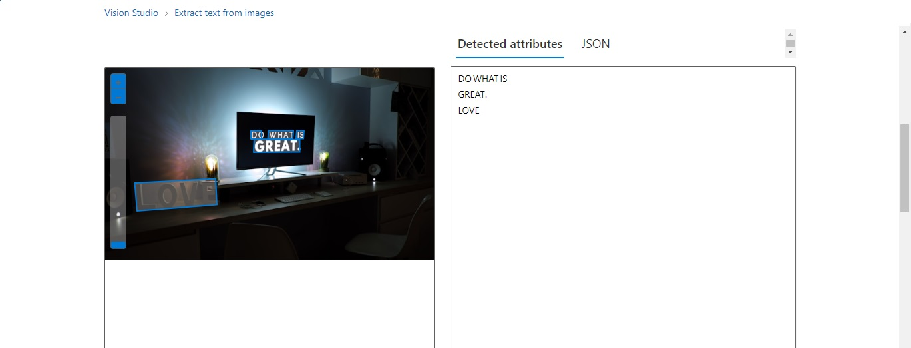
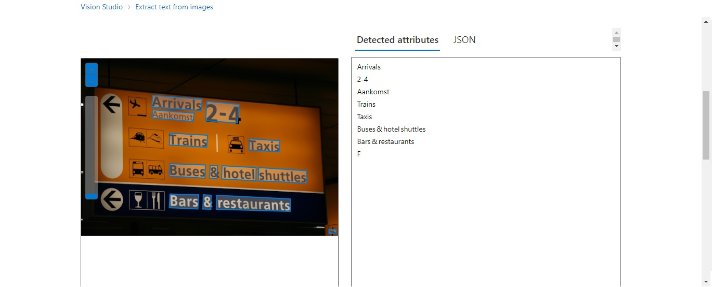

# Desafio de projeto sobre Reconhecimento de texto em imagens no Azure AI

## ℹ️ Sobre:

Consiste na criação de um recurso de IA utilizando a Azure para reconhecimento de informações textuais em imagens.

## ✅ Passos realizados:

> [!IMPORTANT]
>
> - [x] Ter um cadastro na [Azure](https://azure.microsoft.com);
> - [x] Ao logar na conta, criar um **recurso** de `Machine Learning seguindo` as etapas:
>   1. No `MENU`, localizar o link `+ Create a resource`, em `Categories`, selecionar `AI + Machine Learning` e, por fim, clicar em `Azure AI services` e `create`.
>   2. Preencher ALGUMAS informações da seção `BASIC` como `Resource group` e, em **Workspace details**: `Name`.
>   3. Em **Instance Details**, setar um `name`, em **Pricing tier**: selecionar `Standart SO` e deixar o campo "**By checking this box I acknowledge that I have read and understood all the terms below**" checado [x];
>   4. Ir para a seção `Review + Create` e clicar em `create`.
> - [x] Com o recurso criado/deploy finalizado, clicar em acessar o portal [Azure IA - Vision Studio](https://portal.vision.cognitive.azure.com) para realizar os testes no recurso criado - **Necessário realizar o login e selecionar o recurso como default - View all resources**.
> 

 

Dentro do `Vision Studio` seguir os passos abaixo:

* Selecione o serviço para extração de texto de imagens conforme mostra no print abaixo:

* Ao clicar no card - `Extract text from images` -  e carregar a nova página, `checar` o campo abaixo:

* Para enviar uma imagem para `extração de informações` basta clicar em "**Browse for a file**" conforme mostra no print acima.

## 👁️‍🗨️ Testes e resultados obtidos

### Extração de textos

- Na `pasta outputs` é possível ter acesso a TODAS as saídas no formato `JSON`.

> Imagem 1: Entrada e saída

> Imagem 2: Entrada e saída

> Imagem 3: Entrada e saída

> Imagem 4: Entrada e saída

## Conclusão

O Azure AI - Vision Studio - oferece uma poderosa ferramenta chamada **Extract Text from Images** que utiliza modelos de aprendizado de máquina avançados para `identificar` e `extrair texto de imagens` de diversos idiomas. **Isso é particularmente útil em cenários de negócios** onde documentos como `faturas`, `recibos` e `formulários` precisam ser digitalizados e processados automaticamente. Com essa capacidade, **o Azure AI** `simplifica a automação de tarefas que tradicionalmente requerem entrada manual, economizando tempo e reduzindo erros`.

## 🖼️ Imagens

Todas as imagens foram extraídas do site [unsplash](https://unsplash.com/) e são de `uso gratuito` sob a [licença da plataforma](https://unsplash.com/pt-br/licen%C3%A7a).

## 📖 Referências:

* [Read text in Vision Studio](https://microsoftlearning.github.io/mslearn-ai-fundamentals/Instructions/Labs/05-ocr.html)
